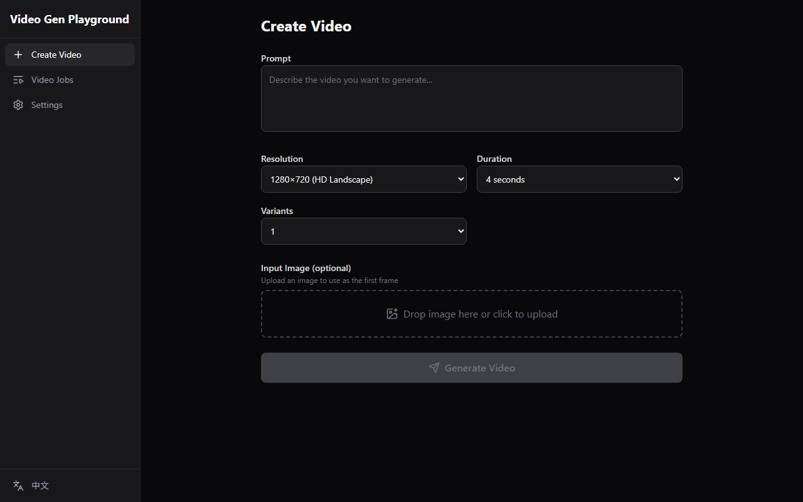

# Video Gen Playground

A web UI for generating videos using the **Sora-2** model via Azure AI Foundry or OpenAI APIs.



## Features

- **Text-to-video** generation with configurable resolution, duration, and variants
- **Image-to-video** — upload an image as the first frame
- **Video extension** — continue a completed video with a new prompt
- **Video editing / remix** — apply targeted edits to existing videos
- **Job management** — list, poll status, view, download, and delete generated videos
- **Dual provider support** — Azure AI Foundry (Entra ID auth) and OpenAI (API key)
- **Bilingual UI** — English and Chinese, auto-detected from browser language
- **Runtime configuration** — switch provider and endpoint without restarting

## Quick Start

```bash
# Install dependencies
npm install

# Configure environment
cp .env.example .env
# Edit .env — set AZURE_ENDPOINT at minimum

# Start dev servers (frontend on :5173, backend on :3000)
npm run dev
```

Open http://localhost:5173 in your browser.

## Configuration

| Variable | Required | Default | Description |
|---|---|---|---|
| `PROVIDER` | No | `azure` | `azure` or `openai` |
| `AZURE_ENDPOINT` | If azure | — | e.g. `https://your-resource.openai.azure.com` |
| `AZURE_DEPLOYMENT_NAME` | No | `sora-2` | Model deployment name |
| `AZURE_CLIENT_ID` | No | — | Managed identity client ID (remote deploy) |
| `OPENAI_API_KEY` | If openai | — | OpenAI API key |
| `PORT` | No | `3000` | Backend server port |

## Authentication

| Environment | Method |
|---|---|
| Local development | Azure CLI token (`az login`) — zero config |
| Remote / deployed | Managed identity via `AZURE_CLIENT_ID` env var |
| OpenAI provider | API key via `OPENAI_API_KEY` env var |

## Architecture

```
Browser (React SPA)  →  Express Backend (/api/*)  →  Azure AI Foundry / OpenAI API
                         ├─ AzureAdapter
                         ├─ OpenAIAdapter
                         └─ EntraID Auth (@azure/identity)
```

The backend proxies all API calls so that tokens and keys never reach the browser.

## Tech Stack

- **Frontend**: React, TypeScript, Vite, Tailwind CSS v4, react-router-dom, react-i18next
- **Backend**: Express, @azure/identity
- **Testing**: Playwright

## Scripts

| Command | Description |
|---|---|
| `npm run dev` | Start frontend + backend concurrently |
| `npm run dev:client` | Start Vite dev server only |
| `npm run dev:server` | Start Express backend only |
| `npm run build` | Type-check and build frontend |
| `npm run lint` | Run ESLint |
| `npx playwright test` | Run E2E tests |

## Project Structure

```
src/
├── client/                 # React frontend
│   ├── components/         # Layout, videos, settings, UI components
│   ├── i18n/               # en.json, zh.json, init
│   └── lib/                # API client, constants, utils
└── server/                 # Express backend
    ├── adapters/           # Azure + OpenAI adapter implementations
    ├── auth/               # Entra ID credential provider
    └── routes/             # /api/videos, /api/config
```

## License

[MIT](LICENSE)
